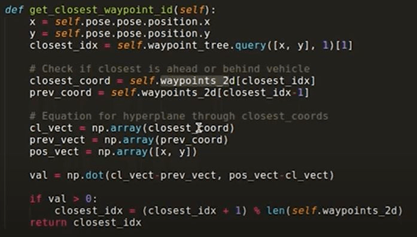
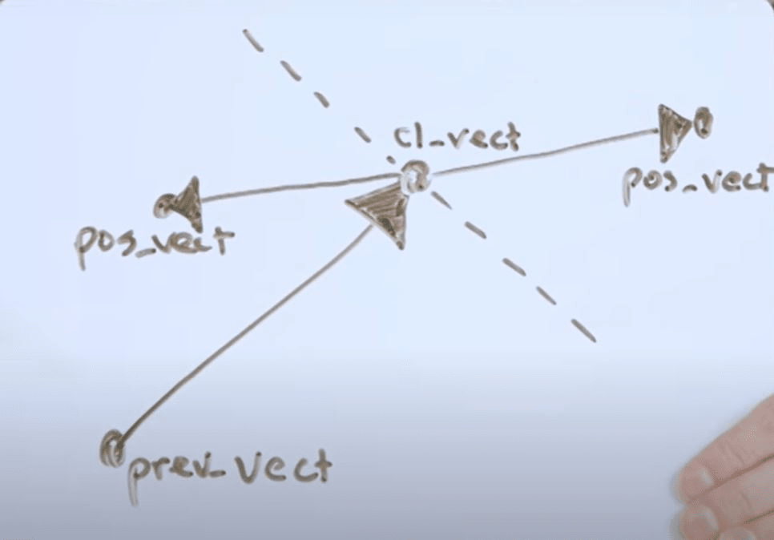
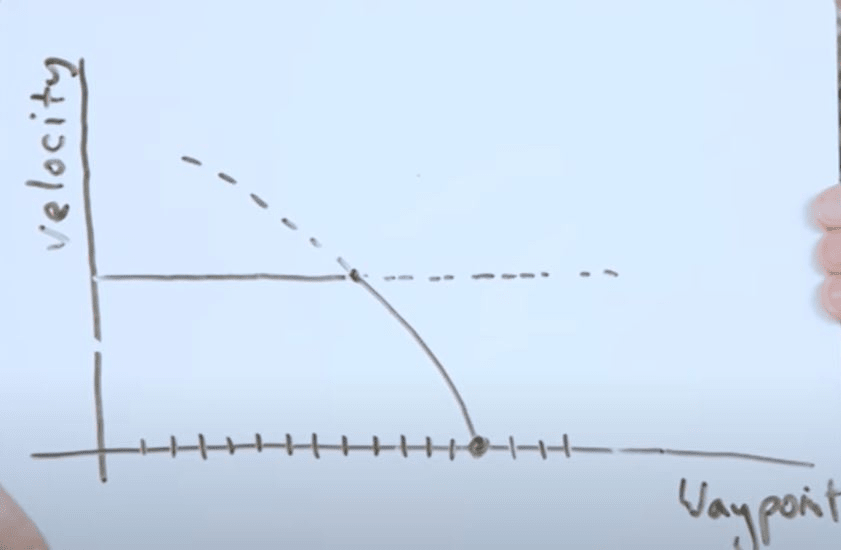

# Programming a Real Self-Driving Car

# System Integration & Implementation
## Overview
---
The car would be operated on a test track and required to follow waypoints in a large circle. If the light is green, then the car is required to continue driving around the circle. If the light is red, then the car is required to stop and wait for the light to turn green. This is a part of the Perception process, one among the three major steps in the system integration project.

For traffic light detection and classification we decided to build a Faster R-CNN network as the purpose of Faster R-CNN is to help fix the problem of selective search by replacing it with Region Proposal Network (RPN). We first extract feature maps from the input image using ConvNet and then pass those maps through a RPN which returns object proposals.  

Due to the limited amount of data available to train the network the decision was made to take a pre-trained network and transfer learn the network on the available simulated and real datasets provided by Udacity.

For this we chose Faster-RCNN. The chosen network was pre-trained with the COCO dataset.

We initially started with SSD (Single Shot Detection) network. Transfer learning was achieved using the Object Detection API provided by Tensorflow. For simulated data the network was trained on the provided data by Udacity, however real-world data provided by Udacity was supplemented with a dataset of labelled traffic light images provided by Bosch. This dataset can be found [here](https://github.com/bosch-ros-pkg/bstld).

## Directory & File Structure

The project has the following five major files:
* waypoint_loader.py
* waypoint_updater.py
* dbw_node.py
* tl_detector.py
* tl_classifier.py
* All the helper files and utils can be found under the 'src' directory upon which this project is built  

## Implementation & Working of the nodes

### waypoint_updater.py

  

The purpose of this node is to publish a fixed number of waypoints ahead of the vehicle with the correct target velocities, depending on traffic lights and obstacles. As the vehicle moves along a path, the waypoint updater is responsible for making changes to the planned path. Waypoint updater publishes the next 100 waypoints ahead of the car's position, with the velocity that the car needs to have at that point. Every 1/30 seconds, it does:
- **Update of closest waypoint**. It does a local search from current waypoint until it finds a local minimum in the distance.
- **Update of velocity**. If there is a red light ahead, it updates waypoint velocities so that the car stops ~stop_distance (node parameter, default: 5.0 m) meters behind the red light waypoint. Waypoint velocities before the stop point are updated considering a smooth deceleration.
- **Traversed waypoints** are dequeued and new points are enqueued, preserving and reusing those in the middle. When a light-state changes, the entire queue is updated as already discribed.

A little bit of math involved in making sure the closest waypoint is actually in front of the car:
  

We make use of 'dot product' to know the direction of the vectors, which would help us determine the position of the waypoint. The waypoint is in front of the car if the dot product is 'positive' and behind the car if the dot product is 'negative'.
  

### dbw_node.py

   

The drive-by-wire node adjusts steering, throttle and brakes according to the velocity targets published by the waypoint follower (which is informed by the waypoint updater node). If the list of waypoints contains a series of descending velocity targets, the PID velocity controller (in the twist controller component of DBW) will attempt to match the target velocity.

- **Steering**: Steering is handled by a predictive steering which is implemented in the YawControllerclass.
- **Throttle**: Throttle is controlled by a linear PID by passing in the velocity cross-track-error (difference between the current velocity and the proposed velocity).
- **Brake**: If a negative value is returned by the throttle PID, it means that the car needs to decelerate by braking. The braking torque is calculated by the formula (vehicle_mass + fuel_capacity * GAS_DENSITY) * wheel_radius * deceleration.

_NOTE_:
- dbw_node.py is currently set up to publish steering, throttle, and brake commands at 50hz. The DBW system on Carla expects messages at this frequency, and will disengage (reverting control back to the driver) if control messages are published at less than 10hz. This is a safety feature on the car intended to return control to the driver if the software system crashes.
- Carla has an automatic transmission, which means the car will roll forward if no brake and no throttle is applied. To prevent Carla from moving requires about 700 Nm of torque.

### waypoint_updater.py (revisited)

  

Once traffic light detection is working properly, we have incorporated the traffic light data into our waypoint updater node. To accomplish this part of the project successfully, we have adjusted the target velocities for the waypoints leading up to red traffic lights or other obstacles in order to bring the vehicle to a smooth and full stop. We successfully accomplished to have a smooth decrease in velocity leading up to the stopping point.

Velocity vs Waypoint (square root function):

We determined the appropriate deceleration for the vehicle, and how this deceleration corresponds to waypoint target velocities making sure the acceleration did not exceed 10 m/s^2 and jerk did not exceed 10 m/s^3.

### tl_detector.py

This python file processes the incoming traffic light data and camera images. It uses the light classifier to get a color prediction, and publishes the location of any upcoming red lights.

### tl_classifier.py
This file contains the TLClassifier class. We used this class to implement traffic light classification. For example, the get_classification method can take a camera image as input and return an ID corresponding to the color state of the traffic light in the image. Also since the Carla currently has TensorFlow 1.3.0 installed. While using TensorFlow, we made sure to test our code with this version before submission.

### sim_traffic_light_config.yaml
This config file contains information about the camera (such as focal length), 2D position of the traffic lights's stop line in world coordinates and a boolean value, <ins>is_site</ins> which is set to false in case of simulator testing and true in case of site testing. This file is parsed to traffic_light_config parameter through launch file.

## Dataset
For simulated data the network was trained on the provided data by Udacity, however real data provided by Udacity was supplemented with a dataset of labelled traffic lights provided by Bosch. This dataset can be found [here](https://github.com/bosch-ros-pkg/bstld).

## Data Collection Strategy
Using different Classification models for the Simulator and Site:
Due to differences in the appearance of the site and simulator traffic lights, using the same traffic light classification model for both might not be appropriate. For this purpose is_site boolean from traffic_light_config is used to load a different classification model depending on the context.

# Building a Classifier:
Getting started with the installation. Find the instructions on [Tensorflow Object Detection API repository](https://github.com/tensorflow/models/tree/master/research/object_detection) and go the path: `tensorflow/models/object_detection/g3doc/installation.md`.
- Clone or download the repo present under tensorflow/models
- Go to github.com/google/protobuf/releases/protoc-3.4.0-win32.zip (choose an appropriate one based on your OS)
- Extract the two downloaded files (mentioned above)
- Run the jupyter notebook 'object_detection_tutorial.ipynb'. This downloads a pretrained model for you. The pretrained model here is COCO (common objects in context)
- The actual detection process takes place in the 'for' loop (in the last cell), which we need to modify based on our needs accordingly
- Loading in your custom images: In the jupyter notebook, make the necessary imports to load your images from a directory, modify the notebook to meet your needs and run it

## How to build a custom (traffic light) object detection model using Tensorflow Object Detection API:

Add your objects of interest to the pre-trained model or use that models weights to give us a head start on training these new objects. The Tensorflow Object Detection API is basically a tradeoff between accuracy and speed.  

Steps:
1. Collect around 500 (or more if you choose to) custom traffic light images ready
2. Hand label the custom images using labelImg
3. Split them into train-test sets
4. Generate a TFRecord for the train-test split
5. Setup a config file
6. Train the actual model
7. Export the graph
8. Bring in the frozen inference graph and use that to classify traffic lights

### Step 1: Collecting custom traffic light images
**Simulator**: Run the simulator with the camera on and follow the instructions to collect the traffic light images from the simulator.

**Site**: Download the carla site's traffic light images from the ROS bag provided by Udacity

### Step 2: Hand labelling the custom traffic light images:
Hand label the traffic light dataset images by using ['labelImg'](https://github.com/tzutalin/labelImg).
Steps:
- Clone the labelimg repository
- Follow along the installation steps meeting your python version requirements
- Run 'python labelimg.py'
- Open dir and open your traffic light dataset images
- For every image, cretae a RectBox around the traffic lights you want to detect and add the labels accordingly (RED, GREEN, YELLOW in our case)
- Save them in the directory of your choice. Follow these steps to custom label all the images

### Step 3: Train-test split:
Do a 90-10 split: Add the images and their matching XML annotation files to train (90%) and test (10%) folders.

### Step 4: Generating TFRecords for the train-test split:
We need some helper code from Dat Tran's [raccoon_dataset](https://github.com/datitran/raccoon_dataset) repository from GitHub. We just need 2 scripts from this repo: 'xml_to_csv.py' and 'generate_tfrecord.py'.

**xml_to_csv.py**:
- Make the necessary modifications in the main function of this file. This will iterate through the train and test to create those separate CSVs and then from these CSVs we create the TFRecord.
- For more info, please go through Dat Tran's medium post: https://towardsdatascience.com/how-to-train-your-own-object-detector-with-tensorflows-object-detector-api-bec72ecfe1d9
- Run the 'python3 xml_to_csv.py' command. Now, you have the CSV files ready: 'train_labels.csv' and 'test_labels.csv'

**generate_tfrecord.py**:
- Next, we need to grab the TFRecord: Go to dattran/raccoon_dataset/generate_tfrecord.py
- Make the necessary modifications based on your requirements (add three 'row_label' values each for RED, GREEN and YELLOW in the if-elif-else statement)
- Make sure you have installed Object Detection (installation.md on github). Run the two commands each for train and test present in the 'Usage' section of generate_tfrecord.py. Now we have the train and test record files ready.

The reason we need the TFRecord files is to convert from anything that will generate data (say, Pascal VOC format) to TFRecord so we could use them with the Object Detection API.

### Step 5: Setup a configuration file
To train our model, we need to setup a config file (along with TFRecord, pre-trained model). Please find all the relevant files, installation information, pre-trained models and more on [Tensorflow Object Detection API](https://github.com/tensorflow/models/tree/master/research/object_detection).

Steps:
- Go to tensorflow/models/object_detection/samples/configs on GitHub
- Download the model of your choice (Faster-RCNN, in our case) from the TF model detection zoo
- Run the two commands, each to donwload the config file and the F-RCNN model (also extract the downloaded model)
- Modify the config file to meet your requirements including, but not limited to, PATH_TO_BE_CONFIGURED, num_classes, batch_size, path to fine_tune_checkpoint
- Add the label map file with item and id values each for RED, YELLOW, and GREEN

### Step 6: Train the actual model
- Run your model using the python command while including the path to save the model, pipeline for the config file.
- At this point, you should see the model summary with the steps and their corresponding loss values
- You could load up Tensorboard, if you want to visualize the values incuding loss, accuracy, steps and training time
- Now, you have the trained model ready. Next, load the model via checkpoint

**Faster RCNN Model Architecture**:
Faster R-CNN was originally published in [NIPS 2015](https://arxiv.org/abs/1506.01497). The architecture of Faster R-CNN is complex because it has several moving parts.

Here's a high level overview of the model. It all starts with an image, from which we want to obtain:
- a list of bounding boxes
- a label assigned to each bounding box
- a probability for each label and bounding box

This [blog](https://tryolabs.com/blog/2018/01/18/faster-r-cnn-down-the-rabbit-hole-of-modern-object-detection/) has a pretty good explanation of how Object Detection works on Faster RCNN.
This [medium post](https://medium.com/@smallfishbigsea/faster-r-cnn-explained-864d4fb7e3f8) is quite helpful to get a quick overview of the Faster RCNN networks.

_NOTE_:

- After experimenting with different models including **SSD Inception V2**, **Faster RCNN** and **Nvidia's Convolutional Neural Network**, we eventually decided to go with Faster RCNN after finding its performance to be compelling for our traffic light dataset. At the end of the day, choosing an appropriate model is a trade-off between accuracy and speed to meet your requirements.  
- Please find the State-of-the-Art Models in Object Detection on [paperswithcode.com](https://paperswithcode.com/task/object-detection). I decided to choose Faster R-CNN based on its performance meeting the requirements for 'accuracy' as opposed to 'speed' in the object detection process. Moreover, TensorFlow hasn't kept abreast of the SOTA models by adding the same to its TensorFlow Object Detection API repository.  

### Step 7: Export the graph
- Export the inference graph and save it
- Go to protobuf compilation present under tesorfow/models/object_detection and export the path. So, this loads up TF, makes the graph and saves it.
- Use this to do the object detection using the notebook object_detection_tutorial.ipynb that came in with the API

### Step 8: Bring in the frozen_inference_graph to classify the traffic lights
- Modify the 'export_inference_graph.py' to meet your requirements
- Run the installation command to export the inference graph (tensorflow/models/object_detection/installation.md). Now, you have the 'frozen_inference_graph.pb' and checkpoint files ready
- Open the object_detection_tutorial.ipynb notebook. Make the necessary modifications in the notebook including, but not limited to, model name, NUM_CLASSES, TEST_IMAGE_PATHS. Run the notebook to see your traffic lights with bounding boxes and their prediction accuracies.
